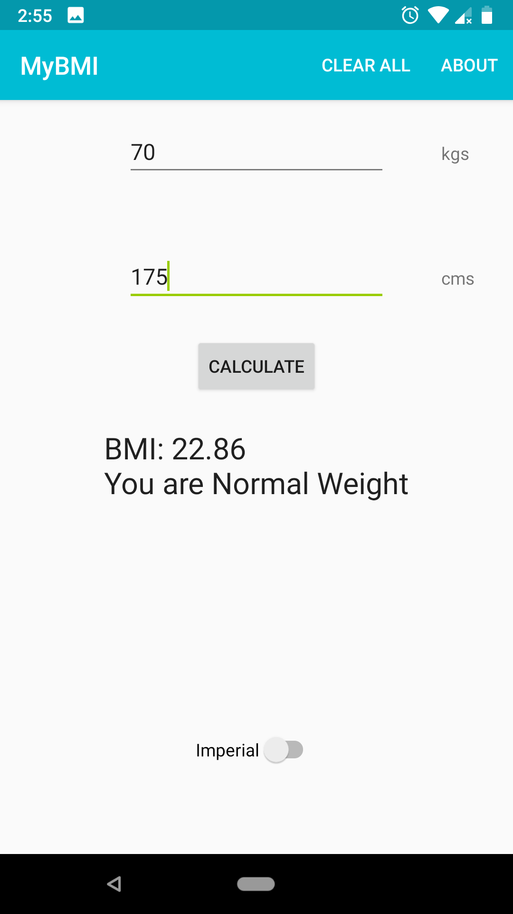

# MyBMI
## Application to calculate Body Mass Index
A simple and privacy friendly android application to calculate your BMI.

### Downloads:

### Screenshots:

  

 

### Availability:
The app is available on Google Play Store, will try to get it on F-Droid as well.

### Feature planned for future release:
* none

### Android Permissions:
* The app requires no permissions to run.

### Why this app even exists ?
Made it just for funsies

### Licensing:
The application is provided under GNU GPL v3, you should have received a copy of the GNU General Public License along with this program. If not, see http://www.gnu.org/licenses/.

“Google Play and the Google Play logo are trademarks of Google LLC.” 